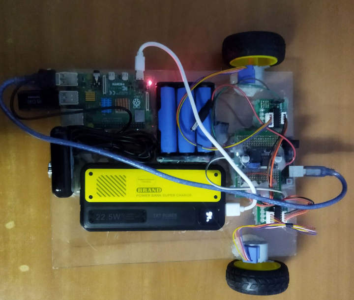

# Ejison [WIP]

A monocular SLAM implementation robot with Raspberry Pi and Arduino Uno board with
28BYJ48 stepper motors.



## Setup and Run ROS2

```bash
UID=$(id -u) GID=$(id -g) docker compose up -d
```

Exec into the container:

```bash
docker exec -it ejison bash
```

Check setup within the container:

```bash
source /opt/ros/jazzy/setup.bash

echo $ROS_DISTRO
```

## Clean up

```bash
UID=$(id -u) GID=$(id -g) docker compose down
```

## Rebuild container image

```bash
UID=$(id -u) GID=$(id -g) docker compose up --build -d
```