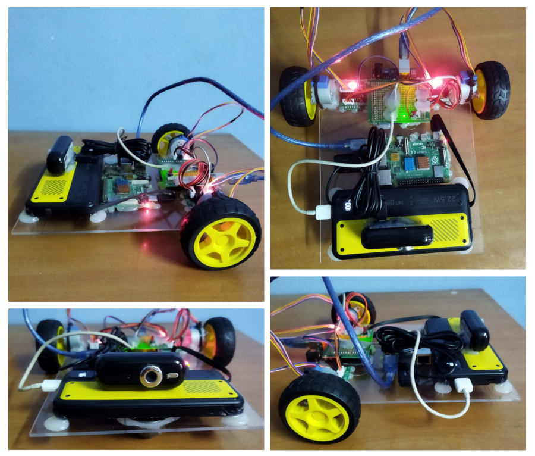

# Ejison [WIP]

A monocular SLAM implementation robot with Raspberry Pi and Arduino Uno board with
28BYJ48 stepper motors.

## Hardware



The main computer of the robot is Raspberry Pi 4B. Two independent stepper motors
28BYJ-48 with ULN2003AN driver is used to drive the robot. The motors are 5V variant
and they are powered directly through USB from the common 1000mAh power bank which 
weight approx. around 200gm. 

At first I was also skeptical if these motor could carry robot's weight 
with accurate steps but upon testing they seems to perform pretty well. The motors are
driven by Arduino Uno board which is serially connected to the Raspberry Pi through
the USB port and commands are first send by the computer to the Arduino board. To
test driving the motors study the README.md of 
[motor_driver_serial_tester](/motor_driver_serial_tester) sub-project.

The camera is connected to the computer through USB. It is an old Pelomax 
(PCW-380) camera that I had laying around. It supports USB 1.1 with VGA (640x480) 
resolution.

## Setup and Run ROS2

All of the development was done in Ubuntu Noble 24.04 dev machine with 
[ros-jazzy](https://docs.ros.org/en/jazzy/index.html) running natively but in the robot 
computer raspberry pi lite OS was used and the whole system was replicated as a single 
docker container with [ros:jazzy-ros-base](https://hub.docker.com/layers/library/ros/jazzy-ros-base/images/sha256-3f3434e8c66b35b4362d43b3c68d4debb705121fc5f16e850b6174f3c304be60) image. Run 
the following commands to setup and get started:

```bash
docker compose up -d
```

Exec into the container:

```bash
docker exec -it ejison bash
```

Check setup within the container:

```bash
source /opt/ros/jazzy/setup.bash

echo $ROS_DISTRO
```

## Clean up

```bash
docker compose down
```

## Rebuild container image

```bash
docker compose up --build -d
```

## Update custom setup

If the devices (camera and arduino board) are connected to your robot computer as same
path as mine or the user and group id are not `1000` then, create `.env` file with 
required changes and then only run docker compose:

```bash
USER_ID=
GROUP_ID=
CAMERA_DEVICE=
SERIAL_DEVICE=
```